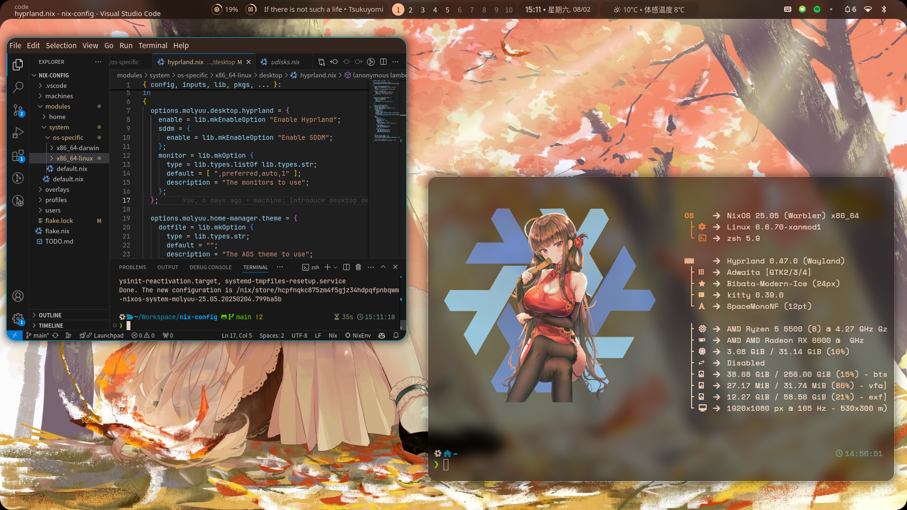

# Illogical Impulse Dotfiles for NixOS
## Screenshot



## Usage

You need to enable `udisks2` service in your system config to make `GVFS Udisks2 Volume Monitor` work, or `Nautilus` won't show your external storge device.
```nix
services.udisks2.enable = true;
```

To use dotfiles, add this flake into your inputs:
```nix
illogical-impulse.url = "github:bigsaltyfishes/end-4-dots";
illogical-impulse.inputs.nixpkgs.follows = "nixpkgs";
```

Then import home manager module in your home-manager configurations:
```nix
{ inputs, ...}:
{
  imports = [
    inputs.illogical-impulse.homeManagerModules.default
  ];
}
```

After all, enable dotfiles with options in your home-manager configuration like:
```nix
{ inputs, pkgs, ... }:
let
  hypr = inputs.hyprland.packages.${pkgs.system};
in
{
  illogical-impulse = {
    # Enable Dotfiles
    enable = true;
    hyprland = {
      # Monitor preference
      monitor = [ ",preferred,auto,1" ];
      # Use cusomize hyprland packages
      package = hypr.hyprland;
      xdgPortalPackage = hypr.xdg-desktop-portal-hyprland;
      # Set NIXOS_OZONE_WL=1
      ozoneWayland.enable = true;
    };
    theme = {
      # Customize Cursors,
      # the following config is the default config
      # if you don't set.
      cursor = {
        package = pkgs.bibata-cursors;
        theme = "Bibata-Modern-Ice";
      };
    };
    # Use custom ags package, the following package is the default.
    # agsPackage = ags.packages.${pkgs.system}.default.override {
    #   extraPackages = with pkgs; [ 
    #     gtksourceview
    #     gtksourceview4
    #     webkitgtk
    #     webp-pixbuf-loader
    #     ydotool
    #   ];
    # };
  };
}
```